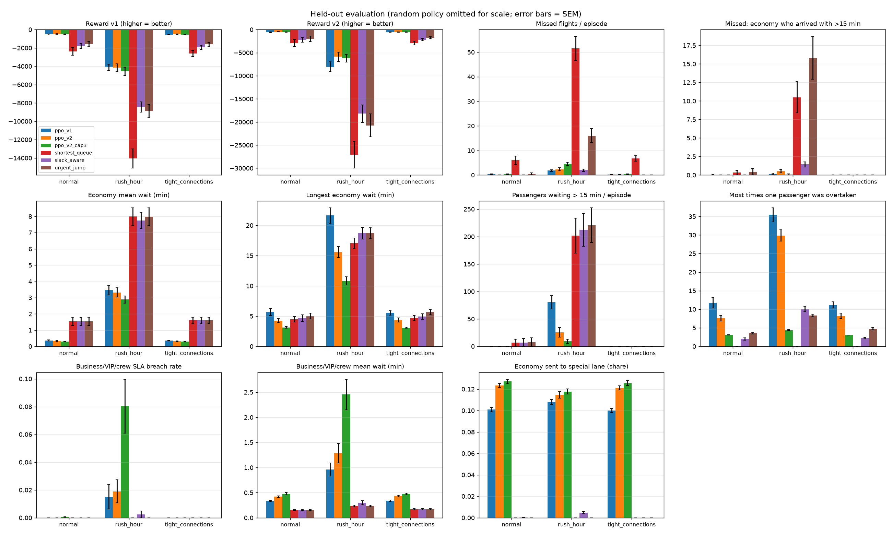
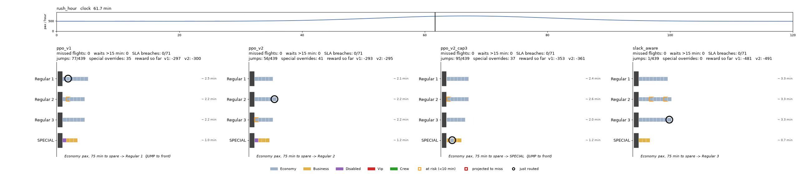

# AIPI 591: Challenge 1: Airport Security Checkpoint Routing with Deep RL Agent
### **Author**: Matana Pornluanprasert

A PPO agent learns to route passengers at an airport security checkpoint with three regular lanes and one special lane. A scanner reads every boarding pass on arrival, so the agent can see who is waiting in each lane and how close each of them is to missing their flight. For every economy passenger, the agent decides whether to send them to the regular lanes or the special lane, and whether to put them at the back of the queue or let them jump to the front. The project trains a first agent (v1), shows how its reward can be exploited (a few passengers are starved in the queue while the average looks good), and fixes it with a revised reward (v2).<br>


***
# Environment<br>
A custom Gymnasium environment (`airport_security_env.py`), simulated event by event in minutes. Every episode is a new, randomly generated 2-hour scenario.<br>

* **Passenger types:** economy, business, disabled/elderly, VIP and crew. The mix comes from a typical two-class Airbus A320 layout (144 economy, 12 business, 6 disabled/elderly in the front economy row, 6 crew), so about 14% of passengers are priority. Each episode's mix is randomly perturbed, and priority passengers are always kept below 25% so the special lane stays useful.
* **Hard rule:** every priority passenger goes to the back of the special lane. The agent only makes decision on economy passengers.
* **Time budget:** each passenger arrives with a number of minutes left until their gate closes (15–100), minus the walk to the gate (3, 10 or 18 minutes), minus 10 extra minutes for disabled/elderly passengers. A passenger misses their flight if queueing plus screening takes longer than their budget.
* **Traffic:** about 510 passengers per hour, roughly 97% of the regular lanes' capacity, so queues of 10–25 people build up at rush hour. Screening times are random (gamma distributed).
* **Scenarios:**
  * `normal`: steady traffic.
  * `rush_hour`: a wave of 35–65% extra traffic lasting 10–18 minutes.
  * `tight_connections`: a 15–30 minute window where 30–50% of arrivals have only 15–35 minutes until their gate closes.
  * `mixed`: the training scenario, where rush hours and tight-connection windows each occur at random.
* **Actions (4):** regular lane or special lane, each at the back of the queue or the front. When the agent picks "regular", staff send the passenger to whichever regular lane has the shortest expected wait.
* **Observation:** for each lane: queue length, expected wait, how many waiting passengers are at risk or projected to miss, and the tightest remaining margin. For the special lane: the longest wait among business, VIP and crew. For the arriving passenger: their time budget, and their projected margin at the back or front of each lane type. Plus recent arrival rate and time of day.<br>
<br>


***
# Design Choices<br>
* **Scenarios fixed at reset:** the whole passenger stream is generated when an episode starts, so every policy evaluated on the same seed faces exactly the same passengers.
* **Reward charged minute by minute:** each waiting passenger's cost is charged as time passes instead of in one lump when they finish screening. The totals are identical, but the agent gets feedback much sooner.
* **Staff choose the regular lane:** when all lanes are busy, total waiting time barely changes whichever lane a passenger joins, so a learned lane choice was close to random and left the lanes unbalanced. Letting staff pick the shortest regular lane keeps the lanes within one passenger of each other.
* **Optional overtake limit (`max_overtakes`):** a passenger cannot be pushed back more than K times, unless the jump is what saves the jumper's flight.<br>
<br>


***
# Model Selection<br>
* **Algorithm:** PPO from Stable-Baselines3, with an MLP policy (two hidden layers of 128 units).
* **Training:** 2,000,000 steps on the `mixed` scenario, 8 parallel environments, discount factor 0.995, with normalized observations and rewards (`VecNormalize`). A run takes about 20 minutes on a CPU.
* **Trained agents:** `runs/v1` (v1 reward), `runs/v2` (v2 reward) and `runs/v2_cap3` (v2 reward plus an overtake limit of 3).<br>
<br>


***
# Reward Design and Failure Mode<br>

**v1 (the original design)** charges for each passenger:
1. Every minute of waiting.
2. Extra for urgent passengers (15 minutes or less of margin when they arrive), up to 4x, plus a one-off penalty of 40 for a missed flight.
3. Extra for every minute a disabled/elderly passenger waits.
4. A penalty for every minute business, VIP or crew wait beyond 8 minutes.

**Failure mode: reward hacking (tail starvation), as seen in v1.** The v1 reward is only a proxy for what we actually want, which is queues that are efficient *and* fair to every passenger. The agent does exactly what the reward asks, and exploits the gaps in it:
* **Blind to who waits:** terms 1–4 are sums of waiting time, which barely change when the order of a queue is reshuffled. The v1 agent learns to let urgent passengers jump again and again, and a few relaxed passengers are overtaken over and over.
* **Urgency fixed on arrival:** a relaxed passenger who is kept waiting until they are about to miss their flight never looks urgent to the reward.
* **Missed passengers are written off:** once a flight is missed, v1 charges nothing more.

The evidence is in the v1 results at rush hour. By its own measures it looks excellent: a 3.5-minute mean economy wait and 1.8 missed flights per episode, both better than every hand-written policy. Behind those averages, 80 passengers per episode wait more than 15 minutes, the longest wait is 21.6 minutes, and one passenger is overtaken 35 times. This is reward hacking rather than poor generalization, because v1 behaves the same way on held-out seeds and in every scenario. It isn't adversarial exploitation either, because nothing in the environment works against the agent. The problem is the reward itself, so v2 fixes it by changing only the reward, keeping the same algorithm, network and training.

**v2 (the mitigation)** changes:
* **Urgency based on remaining margin:** the urgency cost grows as a passenger's remaining margin shrinks while they wait, not from a label fixed when they arrived.
* **Lateness keeps costing:** 5 per minute late after a missed flight.
* **Stricter 8-minute limit** for business, VIP and crew.
* **New 15-minute wait limit for every passenger:** a one-off penalty plus a steep per-minute cost beyond it.<br>
<br>


***
# Agent Performance Evaluation<br>
The PPO agents are compared with four hand-written policies (`baselines.py`):
* `random`: random choices.
* `shortest_queue`: always the back of the shortest regular lane.
* `urgent_jump`: urgent passengers always jump.
* `slack_aware`: a careful rule that only jumps when nobody pushed back would miss their flight.

Evaluation uses 50 held-out episodes per scenario, with seeds never seen in training.

**Rush hour** (about 1,160 passengers per episode, averaged over 50 episodes):

| Metric | PPO v1 | PPO v2 | PPO v2 + overtake limit | slack_aware |
|---|---|---|---|---|
| Missed flights | 1.80 | 2.34 | 4.46 | 1.94 |
| Missed flights by relaxed economy (arrived with >15 min) | 0.18 | 0.52 | 0.08 | 1.44 |
| Mean economy wait (min) | 3.5 | 3.3 | 2.9 | 7.8 |
| Longest economy wait (min) | 21.6 | 15.6 | 10.8 | 18.7 |
| Passengers waiting >15 min | 80 | 26 | 9 | 212 |
| Most times one passenger was overtaken | 35 | 30 | 4.4 | 10 |
| Business/VIP/crew over the 8-min limit | 2% | 2% | 8% | 0% |

For comparison, `shortest_queue` misses 51.5 flights at rush hour and `urgent_jump` misses 16.0.

**Results:**
* v1 already beats every hand-written policy on missed flights and waiting times, but it gets there by starving a few passengers.
* v2 cuts passengers waiting over 15 minutes by about two thirds and the longest wait from 21.6 to 15.6 minutes, at the cost of about 0.5 more missed flights per episode.
* The overtake limit removes starvation almost completely, but misses the most flights. It shows the trade-off between fairness and missed flights.
* In normal traffic every PPO agent misses fewer than 0.4 flights per episode (about 1,025 passengers), with a mean economy wait around 0.3 minutes, compared with 1.5 minutes for the hand-written policies.



The full numbers are in `results/eval_summary.csv`, with per-episode data in `results/eval_episodes.csv`. `results/demo.mp4` shows the agents side by side in all three scenarios.


<br>
<br>


***
# Ethics statement<br>
This project is intended for research and educational purposes in reinforcement learning. The environment is a simplified simulation with synthetic passengers, and no personal data is used. Its main lesson applies to real queue-management systems: optimizing an average can quietly create unfair outcomes for a few individuals, so fairness limits such as a maximum wait should be designed into the objective and checked explicitly, not assumed.<br>
<br>


***
# Requirements and How to run the code

### **Requirements**:<br>
```
gymnasium==1.3.0
stable-baselines3==2.9.0
torch==2.14.0
numpy==2.4.6
pandas==3.0.6
matplotlib==3.11.2
imageio==2.37.4
imageio-ffmpeg==0.6.0
tqdm==4.70.1
rich==15.0.0
```
<br>

### **How to run the code**:<br>
***

Install the requirements (Python 3.11):<br>

```
pip install -r requirements.txt
```

Train the three agents (saved to `runs/<name>/`):<br>

```
python train.py --version v1 --timesteps 2000000
python train.py --version v2 --timesteps 2000000
python train.py --version v2 --timesteps 2000000 --max-overtakes 3 --run-name v2_cap3
```

Evaluate against the baselines (writes `results/eval_summary.csv`, `eval_episodes.csv` and `kpi_comparison.png`):<br>

```
python evaluate.py --runs v1 v2 v2_cap3 --episodes 50
```

Generate the demo video (writes `results/demo.mp4`):<br>

```
python demo_video.py --policies ppo_v1 ppo_v2 ppo_v2_cap3 slack_aware
```

<br>


***
